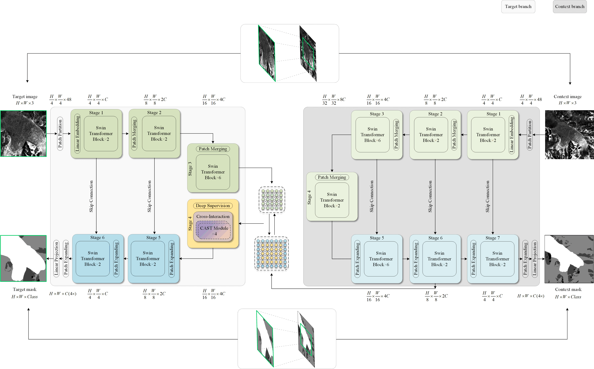

# HookFormer
This repository includes the code for the paper:
 
[**Contextual HookFormer for Glacier Calving Front Segmentation**](https://ieeexplore.ieee.org/document/10440599), accepted by *IEEE TGRS*
Fei Wu, Nora Gourmelon, Thorsten Seehaus, Jianlin Zhang, Matthias Braun, Andreas Maier, and Vincent Christlein



### Abstract
Position changes in glacier calving fronts are important indicators for evaluating the health of ice sheet outlet glaciers and changes in ice dynamics. However, manual delineation of calving fronts in remote sensing imagery is a time-consuming task, resulting in potential large costs. Deep-learning-based methods have made remarkable progress in automatically segmenting and delineating glacier calving fronts from remote sensing imagery. The relatively few remote sensing images and the limited geometric changes for glacier observations both reduce the diversity of the data and exacerbate the difficulty in accurate segmentation. Here we describe a novel automatic method for detecting glacier calving fronts in synthetic aperture radar (SAR) images, termed HookFormer. Our approach processes high-resolution (target) and low-resolution (context) inputs with a unified transformer architecture. The global–local tokens from the context and the target branches are integrated purely by the proposed cross-attention mechanism and cross-interaction module to complement and enhance each other. Moreover, we redesign the HookFormer architecture based on the convolutional neural network (CNN) model AMD-HookNet aiming to improve computational efficiency while achieving significant performance gains with only half of the model parameters/FLOPs. We conduct an in-depth analysis and make extensive comparisons based on the challenging glacier segmentation benchmark dataset CaFFe. As the first pure transformer approach, HookFormer sets a new state of the art with a mean distance error (MDE) of 353 m to the ground truth, outperforming the baseline, Swin-Unet, and AMD-HookNet by 53%, 39%, and 19%, respectively.

### Preprocessing
Prepare train/valid/test datasets based on [CaFFe](https://github.com/Nora-Go/Calving_Fronts_and_Where_to_Find_Them), run center_crop.py, Sliding_window_generate_dataset.py, generate_target_context.py accordingly.

Download the official pretrained [Swin-Transformer](https://github.com/microsoft/Swin-Transformer) backbone model.

### Inference
Please refer to [CaFFe](https://github.com/Nora-Go/Calving_Fronts_and_Where_to_Find_Them) which offers a uniform standard postprocessing and analyzing tool for evaluating experimental results.

### License
Licensed under an MIT license.

### Citation
If you find this work useful for your research, please consider citing our work:
```
@ARTICLE{10440599,
  author={Wu, Fei and Gourmelon, Nora and Seehaus, Thorsten and Zhang, Jianlin and Braun, Matthias and Maier, Andreas and Christlein, Vincent},
  journal={IEEE Transactions on Geoscience and Remote Sensing}, 
  title={Contextual HookFormer for Glacier Calving Front Segmentation}, 
  year={2024},
  volume={62},
  number={},
  pages={1-15},
  keywords={Glaciers;Transformers;Task analysis;Computer architecture;Semantic segmentation;Network architecture;Computational modeling;Glacier calving front segmentation;semantic segmentation;transformer},
  doi={10.1109/TGRS.2024.3368215}}

@ARTICLE{10044700,
  author={Wu, Fei and Gourmelon, Nora and Seehaus, Thorsten and Zhang, Jianlin and Braun, Matthias and Maier, Andreas and Christlein, Vincent},
  journal={IEEE Transactions on Geoscience and Remote Sensing}, 
  title={AMD-HookNet for Glacier Front Segmentation}, 
  year={2023},
  volume={61},
  number={},
  pages={1-12},
  doi={10.1109/TGRS.2023.3245419}}

@Article{essd-14-4287-2022,
AUTHOR = {Gourmelon, N. and Seehaus, T. and Braun, M. and Maier, A. and Christlein, V.},
TITLE = {Calving fronts and where to find them: a benchmark dataset and methodology for automatic glacier calving front extraction from synthetic aperture radar imagery},
JOURNAL = {Earth System Science Data},
VOLUME = {14},
YEAR = {2022},
NUMBER = {9},
PAGES = {4287--4313},
URL = {https://essd.copernicus.org/articles/14/4287/2022/},
DOI = {10.5194/essd-14-4287-2022}
}
```

